# Free fully automated multicloud multiarchitecture Kubernetes cluster (with DeepSeekAI evaluation)

This is our plan for this exercise:

- Build a Kubernetes cluster consisting of:
  - A master node on AWS EC2 ARM instance
  - Worker nodes on GCP and OCI (Oracle Cloud Infrastructure) x86/64 VMs
- Use only free tier cloud resources and fully automate everything in a one-click Terraform deployment
- Ask DeepSeekAI to generate the entire code, identify its mistakes and fix them

Why are we doing this? Because we can :) Let's get started.

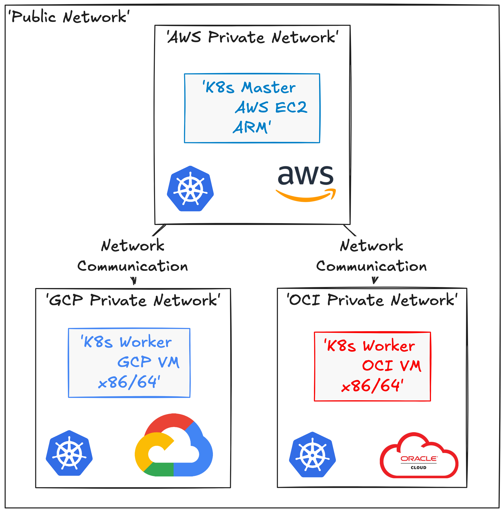

## Prerequisites

- AWS account
  - AWS CLI [installed](https://docs.aws.amazon.com/cli/latest/userguide/getting-started-install.html) and credentials [configured](https://docs.aws.amazon.com/cli/latest/userguide/cli-configure-files.html) in a profile called `free`
- GCP account
  - gcloud CLI [installed](https://cloud.google.com/sdk/docs/install) and credentials [configured](https://cloud.google.com/sdk/docs/initializing) in a default profile
- OCI account
  - oci CLI [installed](https://docs.oracle.com/en-us/iaas/Content/API/SDKDocs/cliinstall.htm) and credentials [configured](https://docs.public.oneportal.content.oci.oraclecloud.com/en-us/iaas/Content/API/Concepts/apisigningkey.htm#two) in a default profile
- Terraform version v1.4.5 (for example using [tfenv](https://github.com/tfutils/tfenv) )
- kubectl [installed](https://kubernetes.io/docs/tasks/tools/)

## The only code that will perform this exercise:

```bash
terraform init
terraform plan -var local_public_ip="$(curl -sSL https://ipconfig.sh)/32" --out local.tfplan
terraform apply -auto-approve -var local_public_ip="$(curl -sSL https://ipconfig.sh)/32"
```

```bash
terraform destroy -var local_public_ip="$(curl -sSL https://ipconfig.sh)/32"
```

## Which components to choose?

For the K8s cluster we will use [K3s](https://k3s.io/), because it is lightweight and (hopefully :)) will fit into Free Tier VMs. Regarding cloud providers, the obvious choice is to use the biggest ones (widest availability, battle-tested solutions). This was originally my choice (to use AWS, GCP and Azure), but apparently Microsoft doesn't want to cooperate with me and I wasn't able to start a free tier account because of below issue:
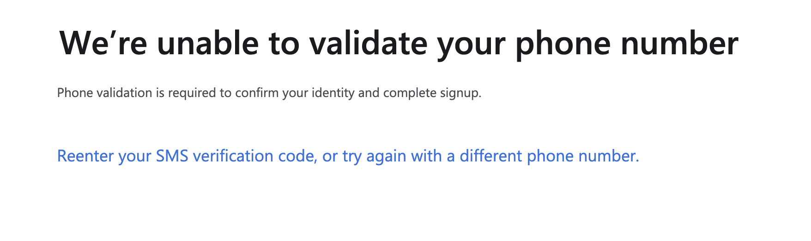
I wasn't able to start Azure Free Tier because of phone validation issue. I've tried all the options there, different numbers, but no luck. I've tried to contact their support and somebody from Microsoft called me back and asked me to mail him with the details :) It was hilarious, because this support member **spelled out his email address to me over the phone** - pure magic :) So I dropped Azure and decided to use Oracle Cloud Infrastructure (OCI) instead since they boast about offering [free 4 vCPU and 24 GM RAM ARM instances](https://www.oracle.com/cloud/free/). Of course reality is far from marketing claims  - it's practically impossible to provision these, because [capacity is almost always full](https://www.reddit.com/r/oraclecloud/comments/1fzvuny/best_oracle_cloud_region_for_free_tier_resources/). I was never able to run this 4 vCPU. Fortunately there is also a regular 1 OCPU VM, so we will use it.

## Manual tests

I've started with manual tests with all three x86/64 VMs, but handling K8s master node on a 1 vCPU was to heavy for AWS Free x86/64 EC2. Check below how worker nodes cannot join master node, because the CPU is overloaded.
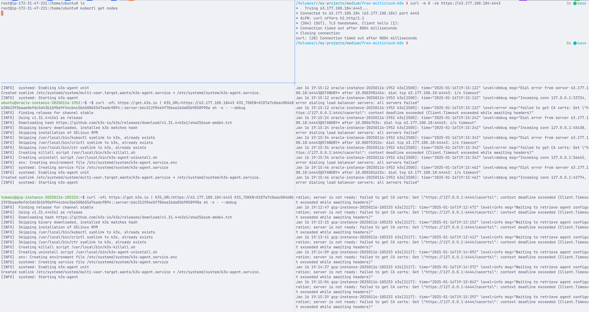

- **Top two terminals:** API server not responding
- **Middle and bottom terminals:** workers cannot join the cluster

Apparently 1 vCPU is not enough for master node. Fortunately I found out that AWS offers of 2 vCPU and 2 GB RAM ARM Graviton2 offer:

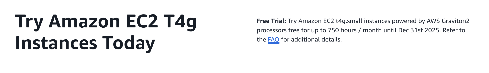

It turned out that this is sufficient and cluster bootstrapped successfully with 2 worker nodes:

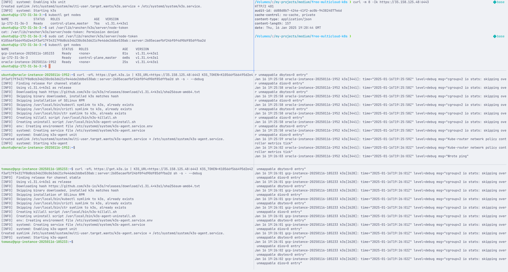

Checking `htop` showed that the master node could handle the load with ~ 80% CPU consumed (at the beginning):

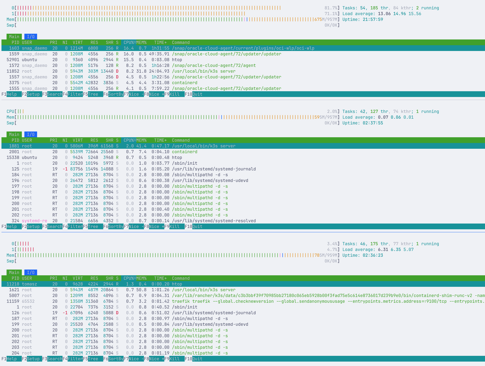

This is how CPU metrics looked like after ~ 15 hours of cluster running:

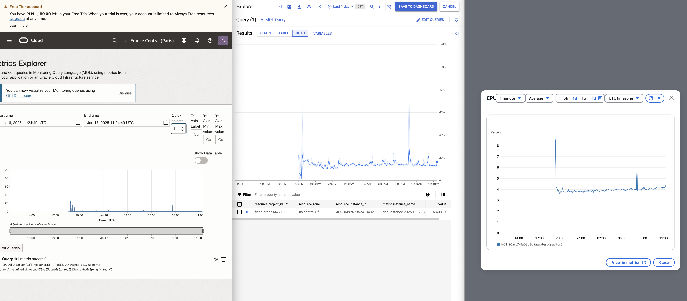

OK, we proved it is doable, so let's automate the whole process.

## Code preparation

DeepSeekAI is trending recently, so let's test if it can replace DevOps engineers by asking it to generate the entire Terraform code for us.

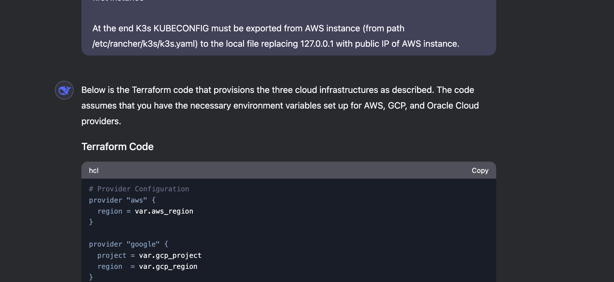

This is the exact prompt that I've used (I'm not a Prompt Engineering PhD, so I only spent a few minutes refining it ;) ):

> Generate Terraform code that will provision three cloud infrastructures as below. All cloud-specific configuration obtain from environment variables. Use default boot disks.
>
> First setup for AWS:
> - instance of type t4g.small in region eu-central-1 with public IP and name prefixed with "k3s-master-aws" and AMI ID ami-000b4fe7b39432646
> - new key pair attached to the instance and outputted to a file
> - security group attached to the instance allowing access via SSH (only from public ip of local laptop running Terraform) and TCP on port 6443 (only from public IPs of instances from second and third setup as well as from public IP of local laptop running Terraform)
> - instance should run following command on startup: curl -sfL https://get.k3s.io | sh -s - --node-external-ip `curl -sSL https://ipconfig.sh` --debug --write-kubeconfig-mode=644
> - after run instance must export K3s token that is needed as a prerequisite for other instances; K3s token can be retrieved with following command: sudo cat /var/lib/rancher/k3s/server/node-token
>
> Second setup for GCP:
> - instance of type e2-micro in region us-central1-f with public IP and name prefixed with "k3s-worker-gcp" and machine image ubuntu-2204-jammy-v20250112
> - new key pair attached to the instance and outputted to a file
> - firewall attached to the instance allowing access via SSH (only from public ip of local laptop running this Terraform code)
> - instance should run following command on startup: curl -sfL https://get.k3s.io | K3S_URL=https://$K3S_MASTER_IP:6443 K3S_TOKEN=$K3S_TOKEN sh -s - --debug ; whereas $K3S_TOKEN is a token extracted from first instance and $K3S_MASTER_IP is a public ip of the first instance
>
> Third setup for Oracle Cloud:
> - instance of type VM.Standard.E2.1.Micro in domain EU-PARIS-1-AD-1 with public IP and name prefixed with "k3s-worker-oracle" and image Canonical-Ubuntu-24.04-2024.10.09-0
> - new key pair attached to the instance and outputted to a file
> - security list attached to the instance allowing access via SSH (only from public ip of local laptop running this Terraform code)
> - instance should run following command on startup: curl -sfL https://get.k3s.io | K3S_URL=https://$K3S_MASTER_IP:6443 K3S_TOKEN=$K3S_TOKEN sh -s - --debug ; whereas $K3S_TOKEN is a token extracted from first instance and $K3S_MASTER_IP is a public ip of the first instance
>
> At the end K3s KUBECONFIG must be exported from AWS instance (from path /etc/rancher/k3s/k3s.yaml) to the local file replacing 127.0.0.1 with public IP of AWS instance.

The original DeepSeekAI-generated code can be found [here](./original-deepseek-infra/). It contained many errors, some detected by my Neovim LSP and others discovered during `plan` or `apply`. Let's take a look at them.

- Here my Neovim LSP is *smarter* than LLM, because it shows that user_data cannot be passed here, but must be a part of `metadata` section for OCI

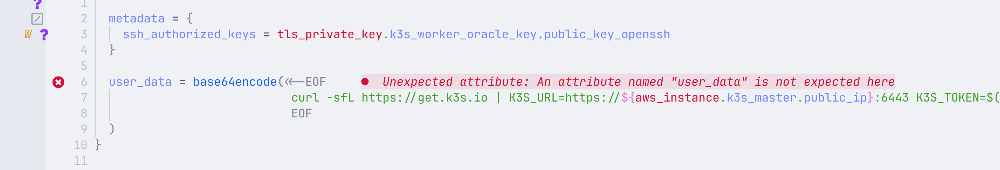

- In general, LSP suggested a lot of useful improvements not added by DeepSeekAI
  - versioning of Providers and TF version
  - variable types
  - others

- DeepSeekAI didn't understand that kubeconfig must be taken from remote server and tried locally
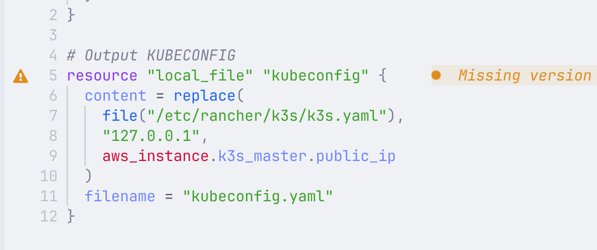

> │ Error: Invalid function argument  
> │  
> │   on main.tf line 158, in resource "local_file" "kubeconfig":  
> │  158:     file("/etc/rancher/k3s/k3s.yaml"),  
> │     ├────────────────  
> │     │ while calling file(path)  
> │  
> │ Invalid value for "path" parameter: no file exists at "/etc/rancher/k3s/k3s.yaml"; this function works only with files that are distributed as part of the configuration source code, so if this file will be created by a resource in this configuration you must  
> │ instead obtain this result from an attribute of that resource.  

- LLM didn't set the correct permissions for downloaded private keys

- LLM forgot to add CIDR ranges for public IPs of workers to AWS Security Group

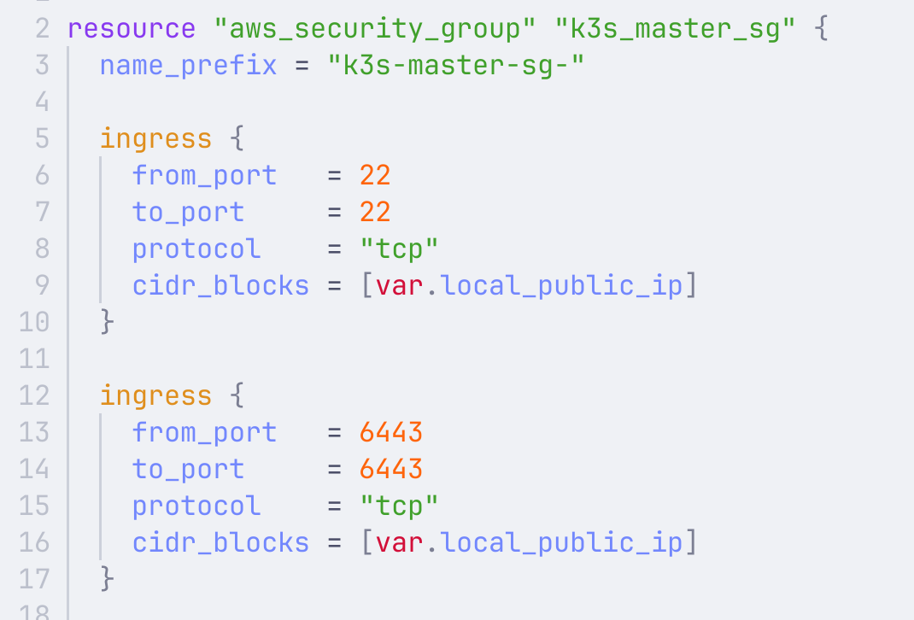

- of course LLM created a cycle code (AWS SG need workers IP, but workers wait for AWS master)

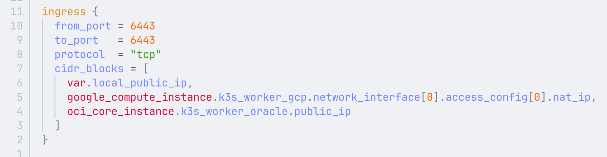

> │ Error: Cycle: oci_core_instance.k3s_worker_oracle, google_compute_instance.k3s_worker_gcp, aws_security_group.k3s_master_sg, aws_instance.k3s_master

- other errors at planning phase:

> │ Error: Reference to undeclared resource 
> │  
> │   on main.tf line 119, in resource "oci_core_security_list" "k3s_worker_oracle_security_list":  
> │  119:   vcn_id         = oci_core_vcn.k3s_worker_oracle_vcn.id  
> │  
> │ A managed resource "oci_core_vcn" "k3s_worker_oracle_vcn" has not been declared in the root module.  
> ╵

> │ Error: Reference to undeclared resource  
> │  
> │   on main.tf line 142, in resource "oci_core_instance" "k3s_worker_oracle":  
> │  142:     subnet_id = oci_core_subnet.k3s_worker_oracle_subnet.id  
> │  
> │ A managed resource "oci_core_subnet" "k3s_worker_oracle_subnet" has not been declared in the root module.  

But forget about LLM, working with OCI is the real *pleasure* here. Check out the next section to see how *intuitive* and *well described* issues of OIC API are !!! (**what a nightmare ....**)

## Running and testing

Let's start applying our fixed TF code. The first OCI issue was as below:
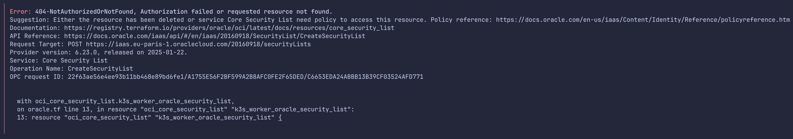
So, what would you expect from 404? Rather sth is wrong with authorization, right? Well, I've spent a lot of time trying to fix it, but everything was fine with authorization. After going through similar issues on the Web I realized that OCI likes to mislead you in such cases and the root cause turned out to be swapping Virtual Cloud Network (VCN) ID with OCID (**SIC!**).

OK, let's move on and we hit 400 - is the request really not formatted properly?
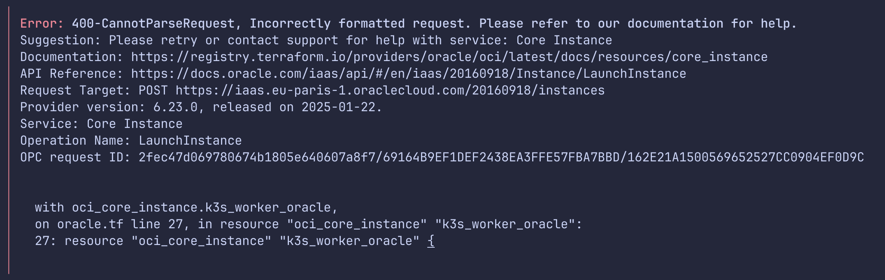
Of course not - this is Oracle Cloud Infrastructure. Here if it says *malformed request* it really means **you have used Availability Domain OCID, but you should use the name** (SIC! again).

By the way, if you look at the [OCI resource example in Terraform docs](https://registry.terraform.io/providers/oracle/oci/latest/docs/resources/core_instance) it doesn't contain **any** real values - sample always use variables which don't have values specified there.

We are moving on, now we hit again 404:

> │ Error: 404-NotAuthorizedOrNotFound, Authorization failed or requested resource not found.  
> │ Suggestion: Either the resource has been deleted or service Core Instance need policy to access this resource. Policy reference: https://docs.oracle.com/en-us/iaas/Content/Identity/Reference/policyreference.htm  
> │ Documentation: https://registry.terraform.io/providers/oracle/oci/latest/docs/resources/core_instance  
> │ API Reference: https://docs.oracle.com/iaas/api/#/en/iaas/20160918/Instance/LaunchInstance
> │ Request Target: POST https://iaas.eu-paris-1.oraclecloud.com/20160918/instances  
> │ Provider version: 6.23.0, released on 2025-01-22. This provider is 1 Update(s) behind to current.  
> │ Service: Core Instance  
> │ Operation Name: LaunchInstance  
> │ OPC request ID: be6fa1c9990b4c6931b4f82169e1f72c/6D10833FEEC791DBBA0382276C54EEBE/4B04722FDBF7F69AAFC89A1A52DB5BE6  
> │  
> │  
> │   with oci_core_instance.k3s_worker_oracle,  
> │   on oracle.tf line 35, in resource "oci_core_instance" "k3s_worker_oracle":  
> │   35: resource "oci_core_instance" "k3s_worker_oracle" {  
> │  

We are smarter now, and we know that if OCI says *authorization* it means *identifier* - and we have a success! Again swapping subnet ID to OCID fixed the issue after few hours of debugging. CTO's - be sure to hire experienced OCI DevOps engineers - Junior engineer will keep on failing into those traps and LLM's will not help them :)

Finally, we reach the last OCI error - 500. Of course they are out of capacity. Over two weeks of testing this TF code I was able to provision this instance **only once**. So we will continue with one worker node.

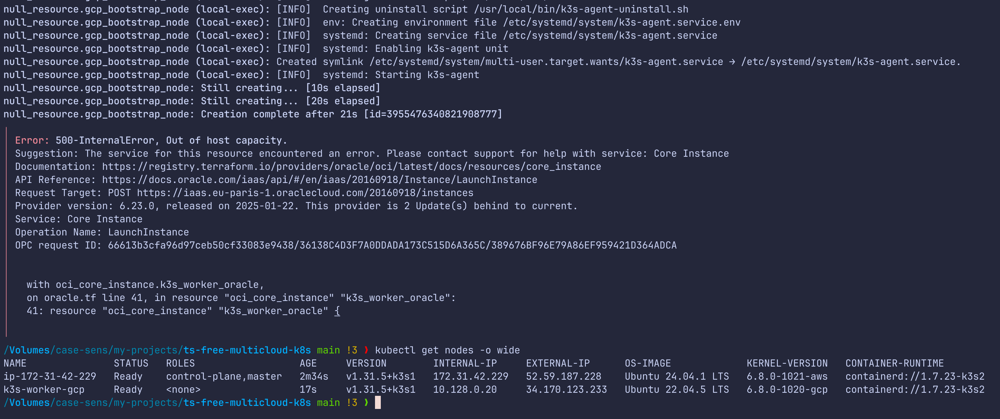

I've deployed simple [NGINX](./nginx-deployment.yaml) and exposed it via [Load Balancer](./nginx-svc.yaml). I've spined up another free AWS instance from which I will test the load. For a start I've triggered two `curl` commands in the background to send few requests per second to the master and worker webservers exposed on NodePorts. Below you can see that all requests passed - not bad for a free cluster.

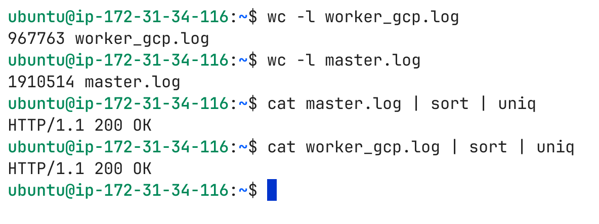

Let's try testing this NGINX with `ab`. This test I was able to do on three nodes. I've sent 1M requests with frequency of 1k per second.

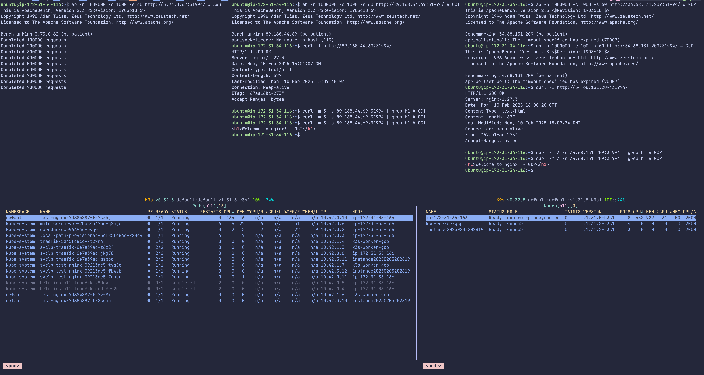

But results are strange - all the load was absorbed by master node. Hmmm ... either I don't see the metrics or I am running all those requests via the same TCP connection what is not balanced by LB.

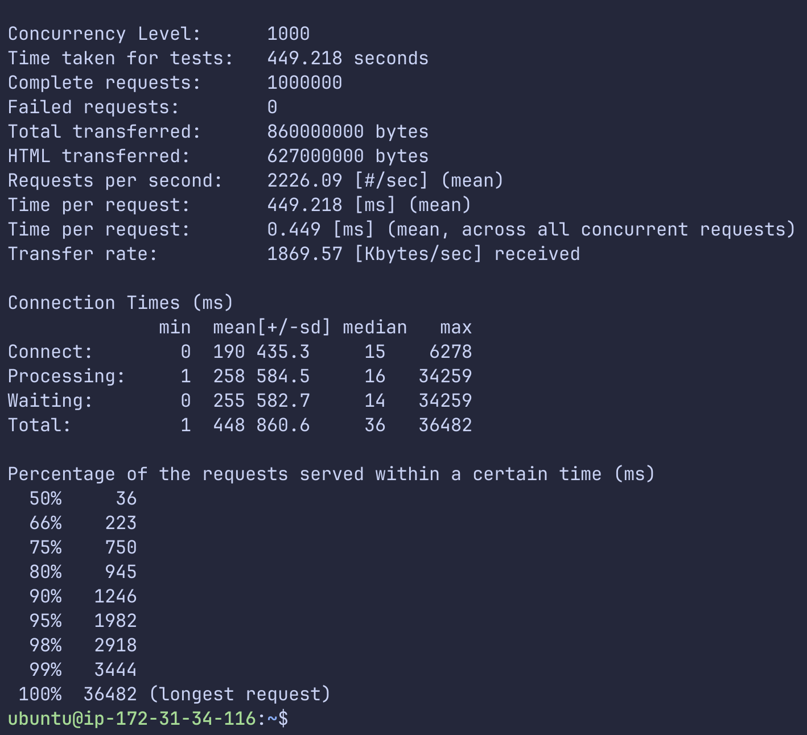
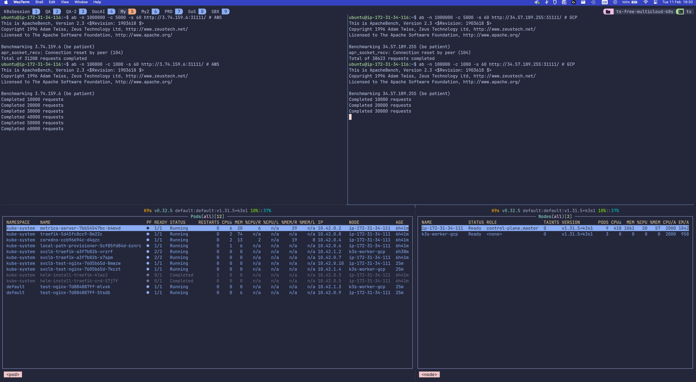
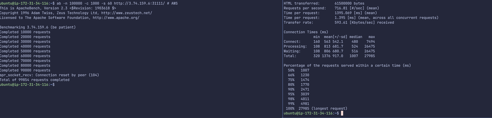

It turned out that both cases were true (metrics were fixed by allowing proper ports). The final test we will do with a proper tool called [Locust](https://locust.io/). It's written in Python and lets you define tests also with Python. Using below script I was able to properly test load on both nodes.

```python
from locust import HttpUser, TaskSet, task, between

# Define the tasks for the first server
class ServerOneTasks(TaskSet):
    @task
    def request_server_one(self):
        self.client.get("/")

# Define the tasks for the second server
class ServerTwoTasks(TaskSet):
    @task
    def request_server_two(self):
        self.client.get("/")

# User class for the first server
class ServerOneUser(HttpUser):
    host = "http://3.74.159.6:31111"
    tasks = [ServerOneTasks]
    wait_time = between(1, 2)  # Simulates think time between requests

# User class for the second server
class ServerTwoUser(HttpUser):
    host = "http://34.57.189.255:31111"
    tasks = [ServerTwoTasks]
    wait_time = between(1, 2)  # Simulates think time between requests
```

I've started with 5000 simulated users in total spawned with rate of 100 every second.

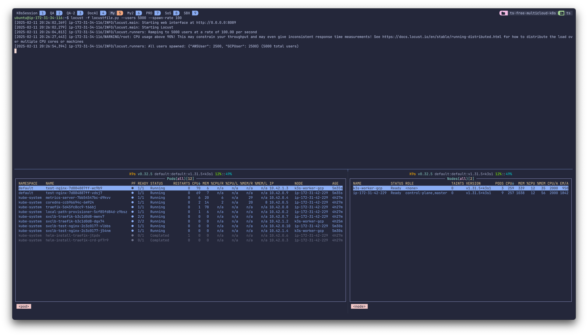
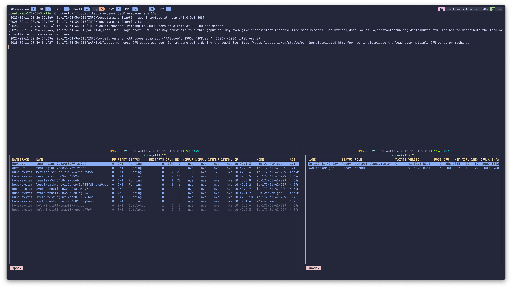

As we can see it resulted in only 3% failures and around 560 requests per second.  

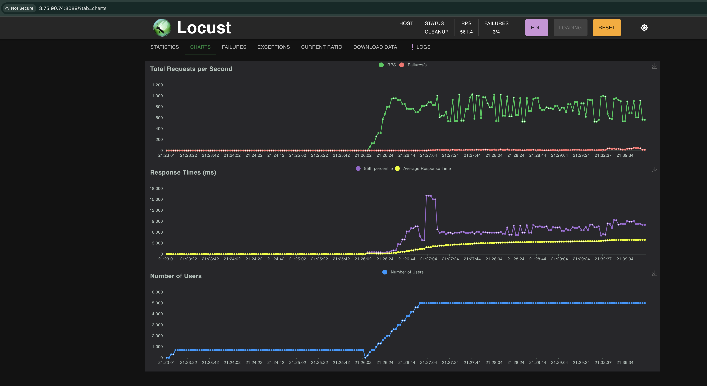

In the next test I've spawned 500 users per second up to 10 000 in total.

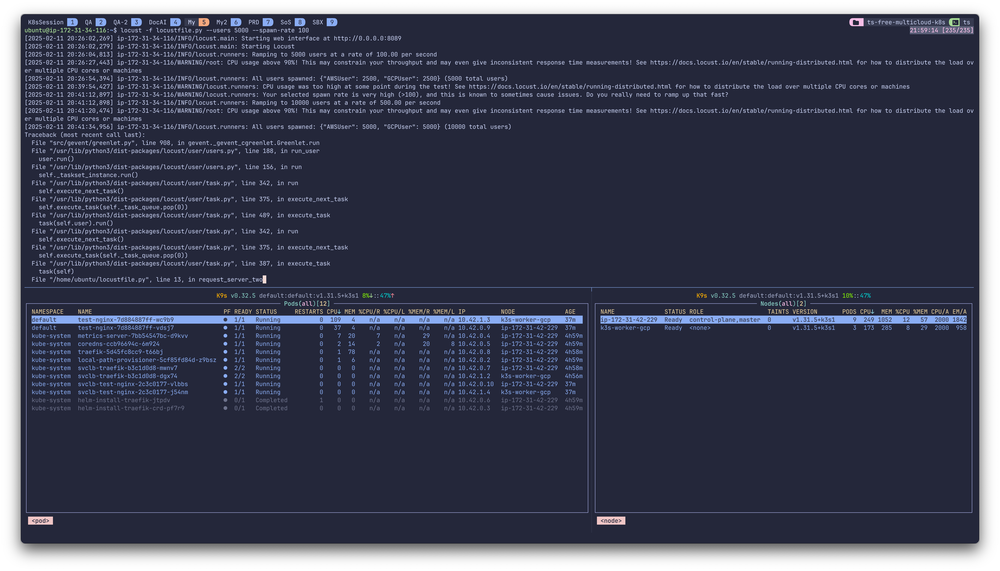
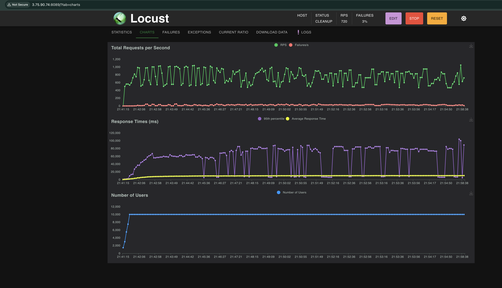

Response time was very high, but still only 3% of failures. **Not bad as for free cluster, huh?**

## Costs

Below you can find cost results on every cloud after a full month of intensive tests.  
OCI as the only one was **truly** free.

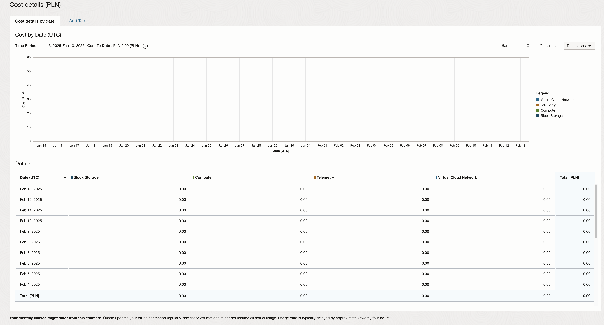

On GCP I got 8PLN from networking and compute.

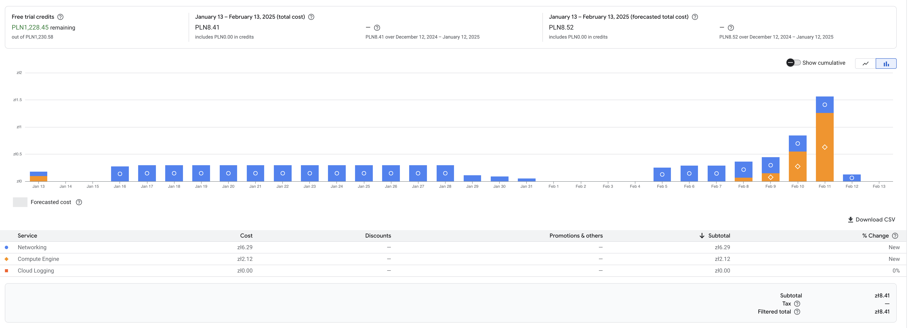

Apparently, I must have reached some kind of limit, but looks like full month of `e2-micro` should be free, so this is strange.

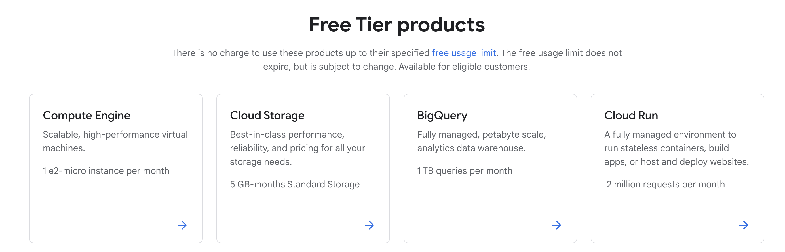
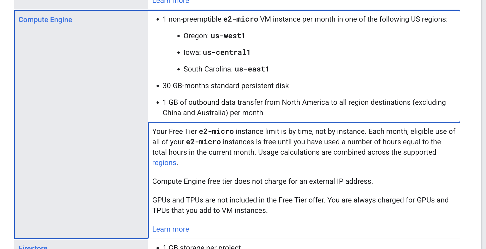

On AWS side I was billed for `EC2-Other` category which is usually storage, so seems like you cannot have free storage allocated free compute (both AWS VMs are in compute free tier).

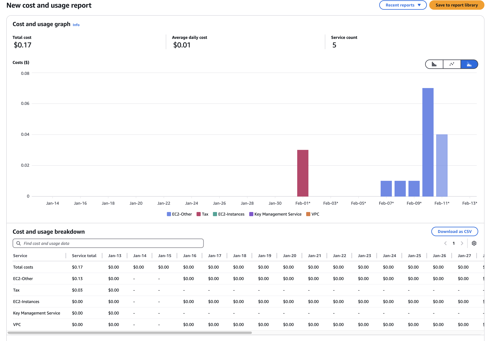

Below you can find metrics for AWS master and GCP worker gathered during last 24 hours of usage that included stress testing with `ab` and `Locust`.

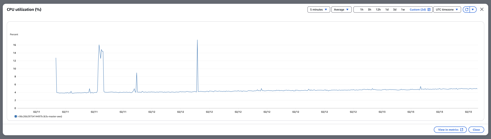
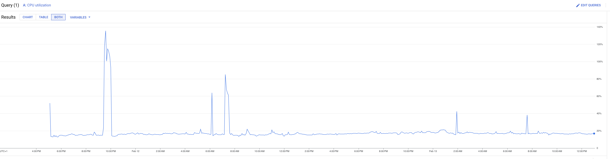

## Summary

We (almost) did it :) - meaning to have a totally free multicloud multiarchitecture K8s cluster. Probably if I had used different machine for stress testing and generated less load this would be completely free. During the journey we learned:

- not to assume that big cloud provided is good (Azure :))
- not to believe cloud marketing (OCI free compute - no actual capacity)
- that DeepSeekAI will not replace DevOps engineers (I hope :))

Stay tuned for other interesting stuff from my side.

## Troubleshooting

Review below page before setting up Terraform for OCI:  
https://docs.oracle.com/en-us/iaas/Content/dev/terraform/tutorials/tf-provider.htm#top
