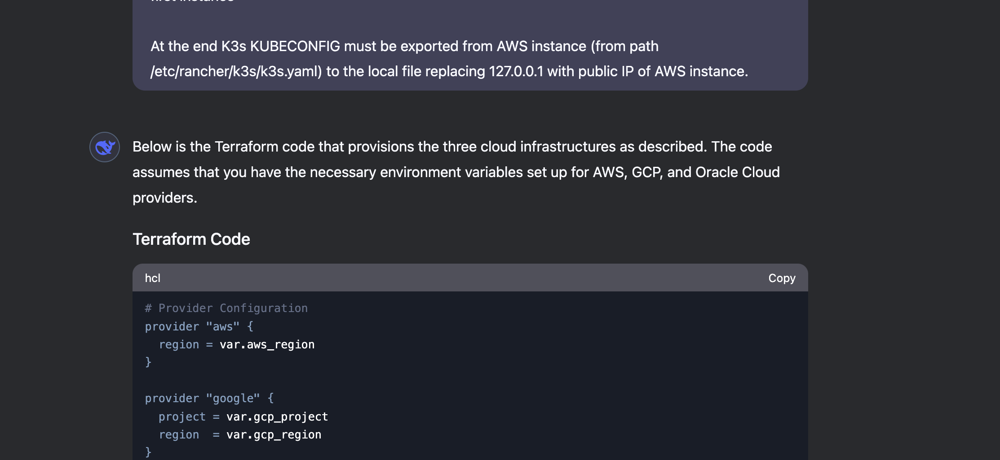
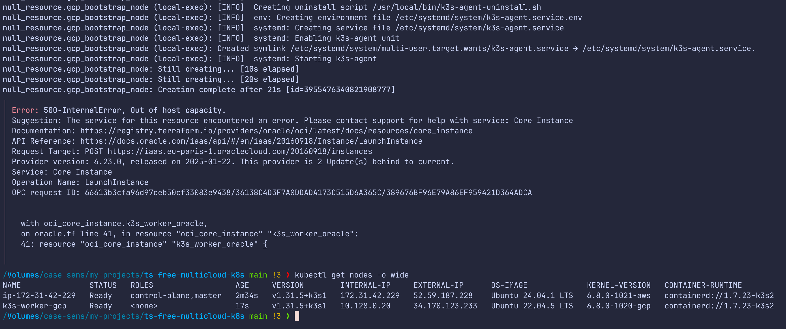
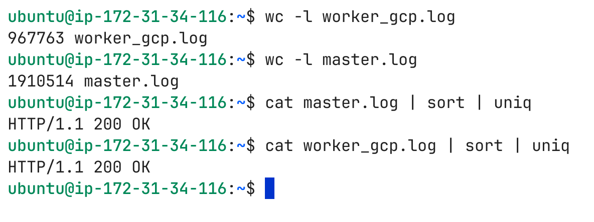
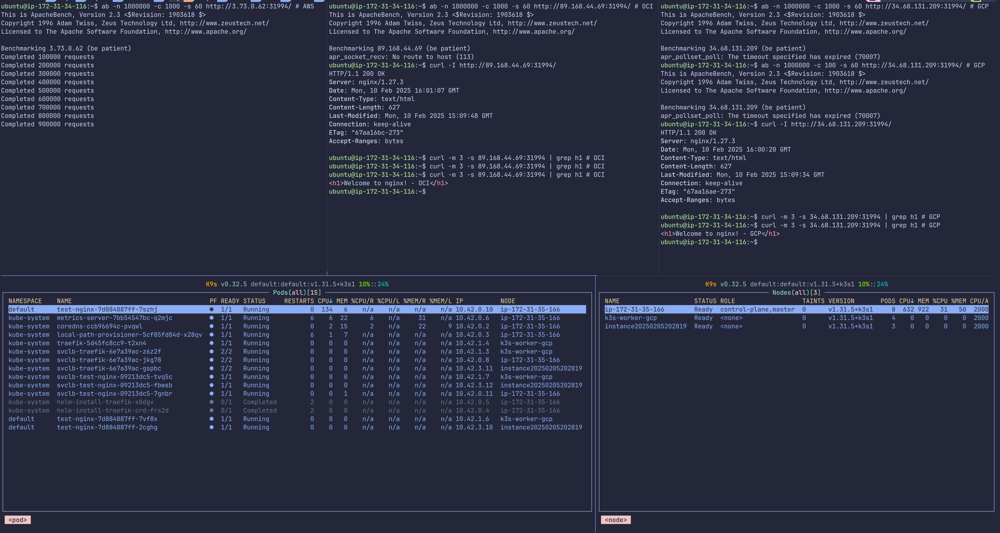
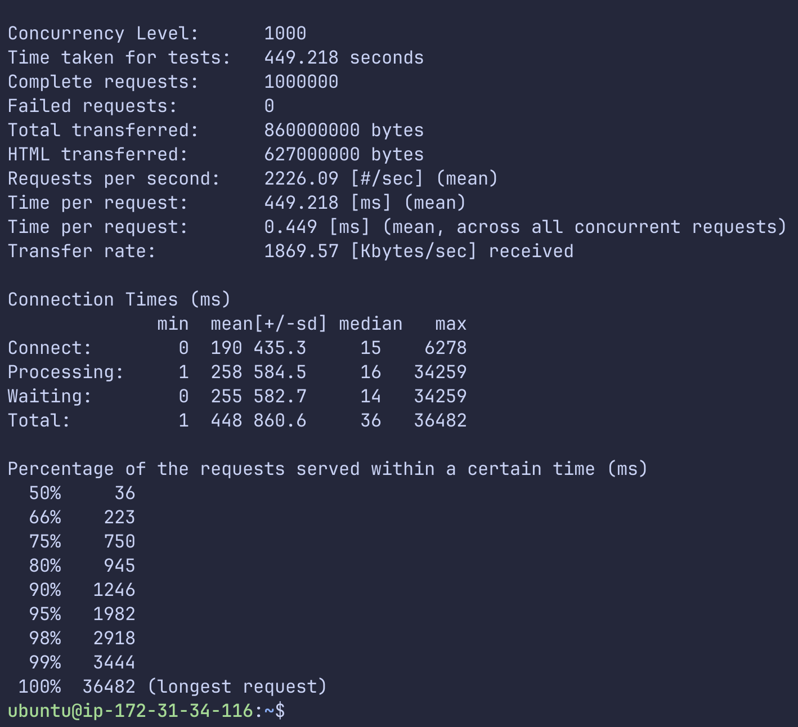
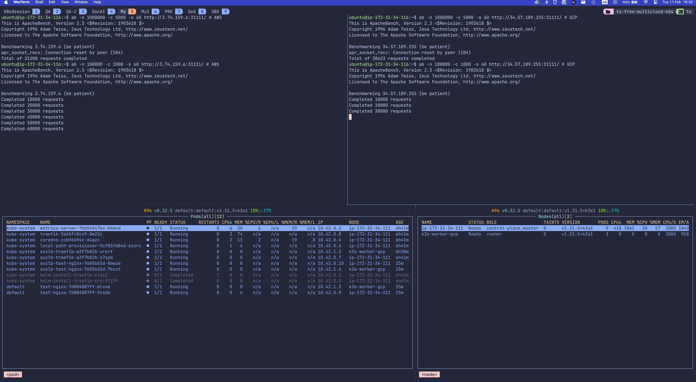
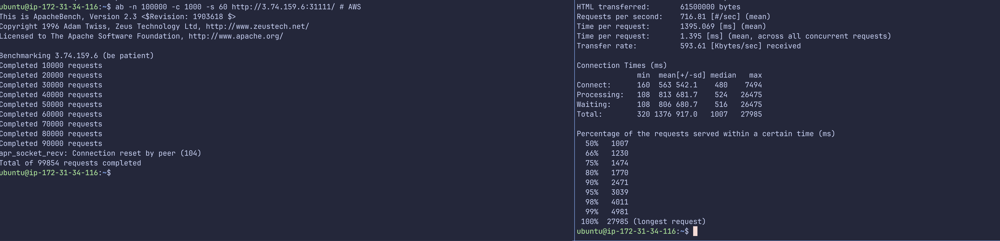
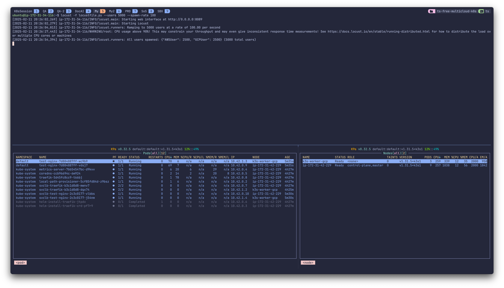
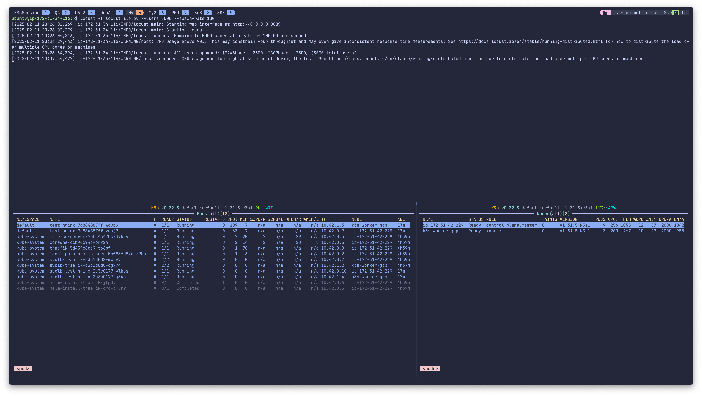

# Free fully automated multicloud multiarchitecture Kubernetes cluster (with DeepSeekAI evaluation)

We are going to build a Kubernetes cluster which will consist of master node on AWS EC2 ARM instance and worker nodes on GCP and OCI (Oracle Cloud Infrastructure) x86/64 VMs. We will only use free tier of cloud resources and fully automate everything in a one-click Terraform deployment. Why are we doing this? Because we can :) We will ask DeepSeekAI for the whole code, point it's mistakes and fix them. Let's get started.

## Prerequisites

- AWS account
  - AWS CLI [installed](https://docs.aws.amazon.com/cli/latest/userguide/getting-started-install.html) and credentials [configured](https://docs.aws.amazon.com/cli/latest/userguide/cli-configure-files.html) in a profile called `free`
- GCP account
  - gcloud CLI [installed](https://cloud.google.com/sdk/docs/install) and credentials [configured](https://cloud.google.com/sdk/docs/initializing) in a default profile
- OCI account
  - oci CLI [installed](https://docs.oracle.com/en-us/iaas/Content/API/SDKDocs/cliinstall.htm) and credentials [configured](https://docs.public.oneportal.content.oci.oraclecloud.com/en-us/iaas/Content/API/Concepts/apisigningkey.htm#two) in a default profile
- Terraform version v1.4.5 (for example using [tfenv](https://github.com/tfutils/tfenv) )
- kubectl [installed](https://kubernetes.io/docs/tasks/tools/)

## Which clouds to choose?

## Manual tests

## Code preparation

 # not works should be under metadata for OCI
 # replaces local with local instead of local with remote

## Running and testing

